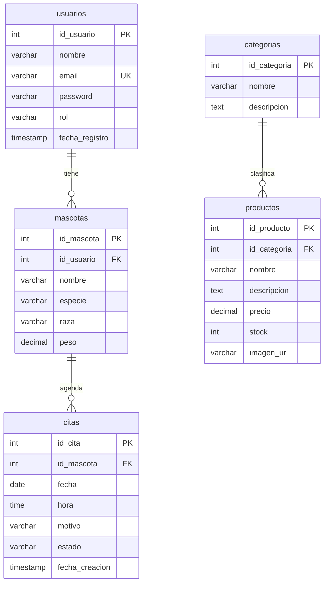

# Diagrama entidad-relación: VETecNM

Base de datos de un sistema para veterinaria (PostgreSQL). Gestiona usuarios (clientes y administradores), sus mascotas, las citas médicas y un catálogo de productos organizado por categorías.

## Diagrama

## Relaciones

| Relación | Cardinalidad | Llave foránea | Al borrar el padre |
|---|---|---|---|
| `usuarios` → `mascotas` | 1 a N | `mascotas.id_usuario` | `CASCADE` (se borran sus mascotas) |
| `mascotas` → `citas` | 1 a N | `citas.id_mascota` | `CASCADE` (se borran sus citas) |
| `categorias` → `productos` | 1 a N | `productos.id_categoria` | `SET NULL` (ver nota) |

## Descripción de las tablas

### usuarios
Clientes y administradores del sistema.

| Campo | Tipo | Restricciones |
|---|---|---|
| `id_usuario` | SERIAL | PK |
| `nombre` | VARCHAR(100) | NOT NULL |
| `email` | VARCHAR(100) | UNIQUE, NOT NULL |
| `password` | VARCHAR(255) | NOT NULL |
| `rol` | VARCHAR(20) | CHECK (`cliente`, `admin`), default `cliente` |
| `fecha_registro` | TIMESTAMP | default `CURRENT_TIMESTAMP` |

### mascotas
Un usuario puede tener varias mascotas.

| Campo | Tipo | Restricciones |
|---|---|---|
| `id_mascota` | SERIAL | PK |
| `id_usuario` | INT | FK → `usuarios`, NOT NULL |
| `nombre` | VARCHAR(100) | NOT NULL |
| `especie` | VARCHAR(50) | NOT NULL |
| `raza` | VARCHAR(50) | |
| `peso` | DECIMAL(5,2) | |

### citas
Cada cita está vinculada a una mascota específica.

| Campo | Tipo | Restricciones |
|---|---|---|
| `id_cita` | SERIAL | PK |
| `id_mascota` | INT | FK → `mascotas`, NOT NULL |
| `fecha` | DATE | NOT NULL |
| `hora` | TIME | NOT NULL |
| `motivo` | VARCHAR(255) | NOT NULL |
| `estado` | VARCHAR(20) | CHECK (`Pendiente`, `Confirmada`, `Finalizada`, `Cancelada`), default `Pendiente` |
| `fecha_creacion` | TIMESTAMP | default `CURRENT_TIMESTAMP` |

### categorias
Organizan el catálogo de la tienda.

| Campo | Tipo | Restricciones |
|---|---|---|
| `id_categoria` | SERIAL | PK |
| `nombre` | VARCHAR(100) | NOT NULL |
| `descripcion` | TEXT | |

### productos
Cada producto pertenece a una categoría.

| Campo | Tipo | Restricciones |
|---|---|---|
| `id_producto` | SERIAL | PK |
| `id_categoria` | INT | FK → `categorias`, NOT NULL |
| `nombre` | VARCHAR(150) | NOT NULL |
| `descripcion` | TEXT | |
| `precio` | DECIMAL(10,2) | NOT NULL |
| `stock` | INT | default 0 |
| `imagen_url` | VARCHAR(255) | |

## Observaciones

- **Inconsistencia en `productos`:** `id_categoria` está declarada como `NOT NULL`, pero su llave foránea usa `ON DELETE SET NULL`. Al borrar una categoría con productos, PostgreSQL marcará error. Se resuelve quitando el `NOT NULL` o cambiando a `ON DELETE RESTRICT`.
- **Módulos independientes:** la tienda (`categorias`, `productos`) no se relaciona con `usuarios` ni `citas`. Si se agregan pedidos o ventas, ahí se enlazaría con `usuarios`.
- **Contraseñas:** los datos de ejemplo guardan las contraseñas en texto plano. En un entorno real deben almacenarse con hash (por ejemplo, bcrypt).
